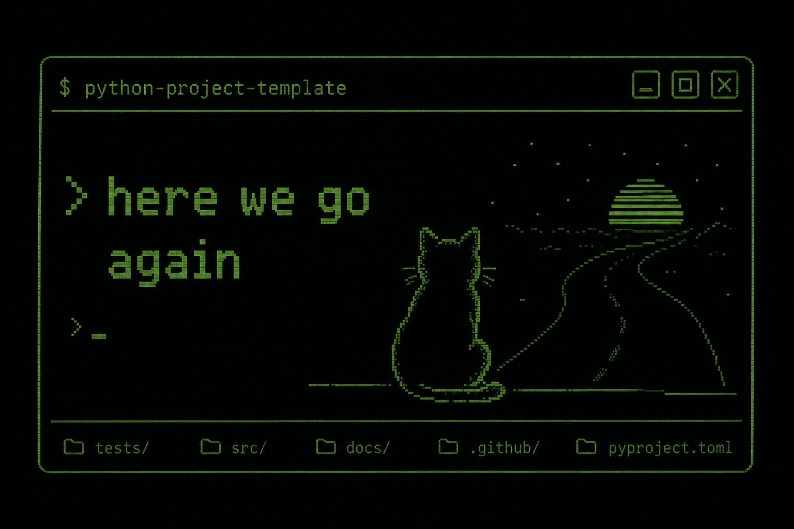

# python project template

A starting point for small Python projects.

It keeps the default setup in one place. It uses text files, predictable tooling, and the same checks in local development and CI.

<div align="center">
  
</div>

---

## What is included

- `src/` and `tests/` layout, ready for a package
- Poetry for dependency management
- Ruff for linting and formatting
- Mypy in strict mode
- Pytest with coverage
- Pre-commit hooks that run the same checks as CI
- GitHub Actions for code style and tests
- `.editorconfig` for consistent formatting across editors
- Issue and PR templates
- Semantic version releases from conventional commits

---

## Tooling

- Python 3.14, Poetry
- Ruff, Mypy, Pytest

---

## Use this template

1. Click **Use this template** on GitHub (or `git clone` and re-init).
2. Rename the package in `pyproject.toml` (`[tool.poetry] name` and `packages`).
3. Replace this README with one for your actual project.
4. Update `LICENSE` copyright year/name if needed.

## Quick start

```bash
poetry install
poetry run pre-commit install
```

### Virtual environment on macOS

Install Python 3.14 if it is not installed:

```bash
brew install python@3.14
```

Point Poetry at it and create the virtual environment:

```bash
poetry env use 3.14
poetry install
```

Activate it in your shell:

```bash
eval "$(poetry env activate)"
```

To deactivate:

```bash
deactivate
```

`poetry run <command>` works without activating the environment. Use activation only if you want `python` or `pytest` to resolve directly.

## Checks

```bash
poetry run ruff check .
poetry run mypy src
poetry run pytest tests --cov=src
```

These checks run in CI on every pull request. See [CONTRIBUTING.md](CONTRIBUTING.md).

## Versioning

Every push to `main` runs [semantic-release](https://github.com/semantic-release/semantic-release). It reads commit messages, decides the version bump, and creates a `vX.Y.Z` tag with a draft GitHub release.

| Commit prefix | Bump |
|---|---|
| `fix:` | patch |
| `feat:` | minor |
| `feat!:` / `BREAKING CHANGE:` in body | major |
| `docs:`, `test:`, `ci:`, `refactor:` | none |
